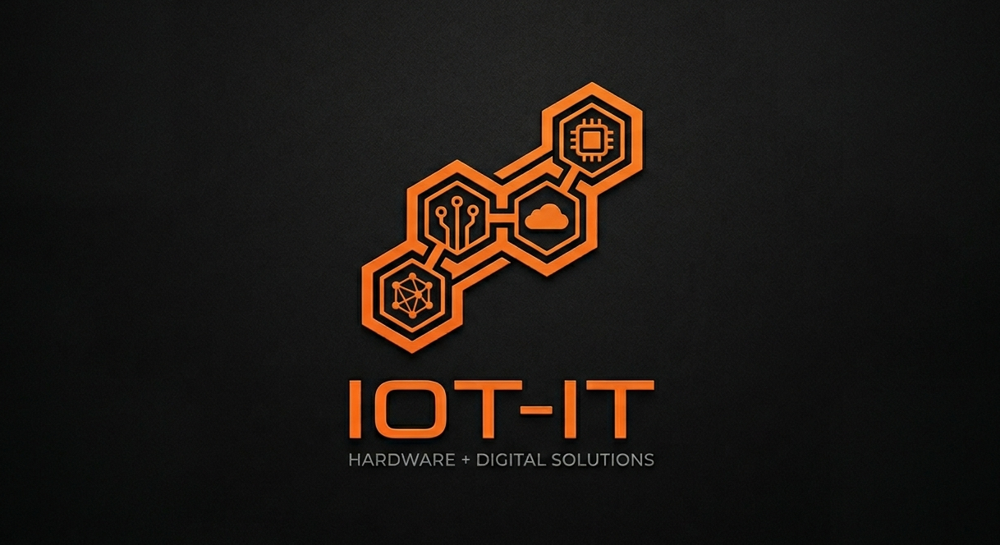

# IOT-IT

### Inteligencia Física para la Industria y el Agro

### René Miguel Luna

**Founder @ IOT-IT**  
Embedded Systems Developer • Industrial Automation Specialist • IoT Solutions Architect

*"Designing reliable industrial systems from hardware to cloud."*

# Sobre mí

Soy desarrollador de sistemas embebidos y técnico en automatización industrial especializado en el diseño de soluciones industriales, dispositivos IoT, comunicaciones industriales y plataformas Linux embebidas.

Actualmente lidero **IOT-IT**, una startup enfocada en el desarrollo de tecnologías para la industria y el agro, combinando hardware inteligente, firmware, conectividad y análisis de datos.

# Áreas de Especialización

### Embedded Systems

- STM32

- ESP32

- RP2040

- Raspberry Pi

- ARM Cortex-M

- Embedded Linux

### Industrial Automation

- Modbus RTU/TCP

- RS485

- MQTT

- CAN Bus

- PLC Integration

- Industrial Networking

### Electronics Design

- PCB Design

- KiCad

- Hardware Prototyping

- Industrial Electronics

- Sensor Integration

- Power Systems

# Tecnologías

### Firmware & Software

  
  
  

### Embedded Platforms

  
  
  

### Industrial & IoT

  
  
  

# Proyectos Destacados

## 🚦 CSL Controller

Arquitectura de control semafórico modular inspirada en estándares industriales.

**Características**

- Arquitectura escalable

- Comunicación RS485

- Expansión mediante periféricos inteligentes

- Configuración basada en objetos

- Diseño orientado a mantenimiento

## 🌐 IoT Modular Platform

Plataforma de dispositivos IoT industriales basada en Linux Embedded.

**Incluye**

- Telemetría

- Gestión remota

- Actualizaciones OTA

- Arquitectura modular

- Edge Computing

## 🌱 Smart Agriculture

Tecnologías para agricultura inteligente y monitoreo remoto.

**Aplicaciones**

- Sensado ambiental

- Control de riego

- Monitoreo de silobolsas

- Redes LoRa

- Automatización rural

## 🐧 Soprano-OS

Distribución Linux Embedded para dispositivos industriales.

**Objetivos**

- Control total de la plataforma

- Seguridad

- Modularidad

- Integración industrial

- Gestión remota

# Filosofía de Desarrollo

### Hardware First

Los sistemas industriales deben diseñarse considerando primero el entorno físico donde operarán.

### Reliability Matters

La confiabilidad es una característica del diseño, no una consecuencia.

### Documentation Driven

Todo sistema escalable necesita una documentación clara y mantenible.

### Open Architecture

Los sistemas modulares permiten crecer sin reemplazar toda la infraestructura.

# Actualmente Explorando

- Industrial IoT

- Edge Computing

- Embedded Linux

- LoRaWAN

- Smart Agriculture

- Smart Infrastructure

- Linux BSP Development

- Industrial Cybersecurity

# IOT-IT

### Inteligencia Física para la Industria y el Agro

Desarrollamos soluciones tecnológicas para:

- Industria 4.0

- Agricultura Inteligente

- Telemetría

- Automatización Industrial

- Sistemas Embebidos

- Plataformas IoT

### Conectemos

📧 [rene.miguel.luna@gmail.com](mailto:rene.miguel.luna@gmail.com)

🌐 IOT-IT (próximamente)

💼 [LinkedIn](https://www.linkedin.com/in/rene-luna/)

*"Transformando ideas en sistemas industriales confiables."*

